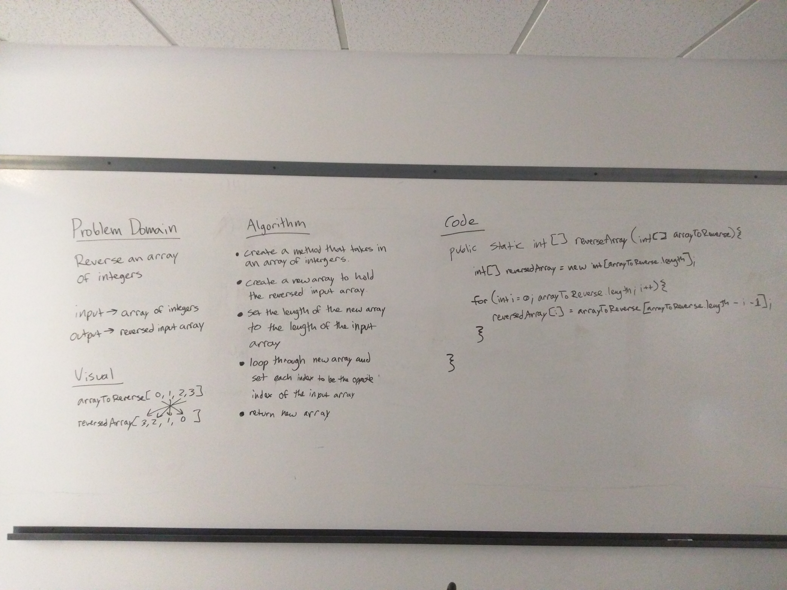

# Code Challenge 1 - Reverse an Array
Write a function called reverseArray that takes in an array and returns a reversed version of the original array without using any built-in java methods.

## Challenge
The functions needs to be able to work on arrays of any length.

## Approach & Efficiency
I took the approach I thought was easiest.

## Solution
