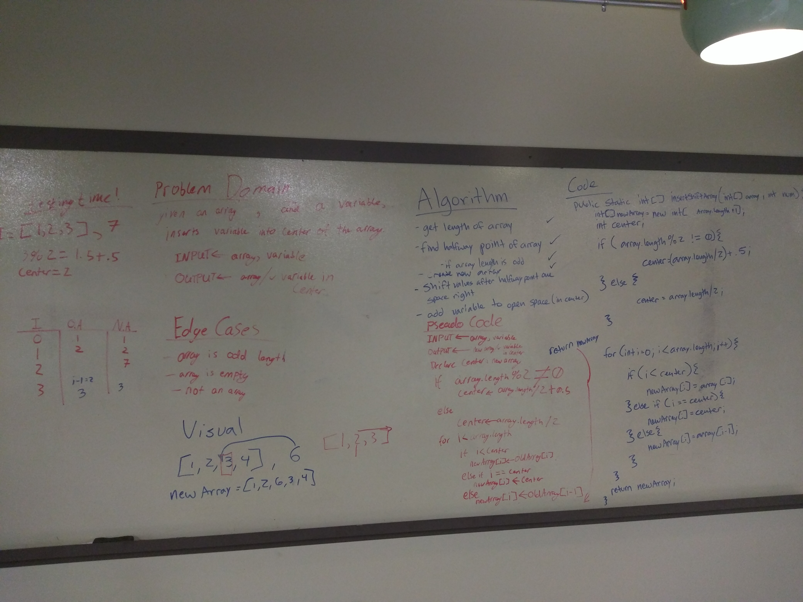

# Code Challenge 2 - Insert and shift middle index of array
Write a function called insertShiftArray which takes in an array and a value to be added and return an array with the new value added at the middle index without using any built-in java methods.

## Challenge
The functions needs to work arrays with even and odd numbered lengths.

## Approach & Efficiency
I took the approach I thought used the simplest logic.

## Solution
