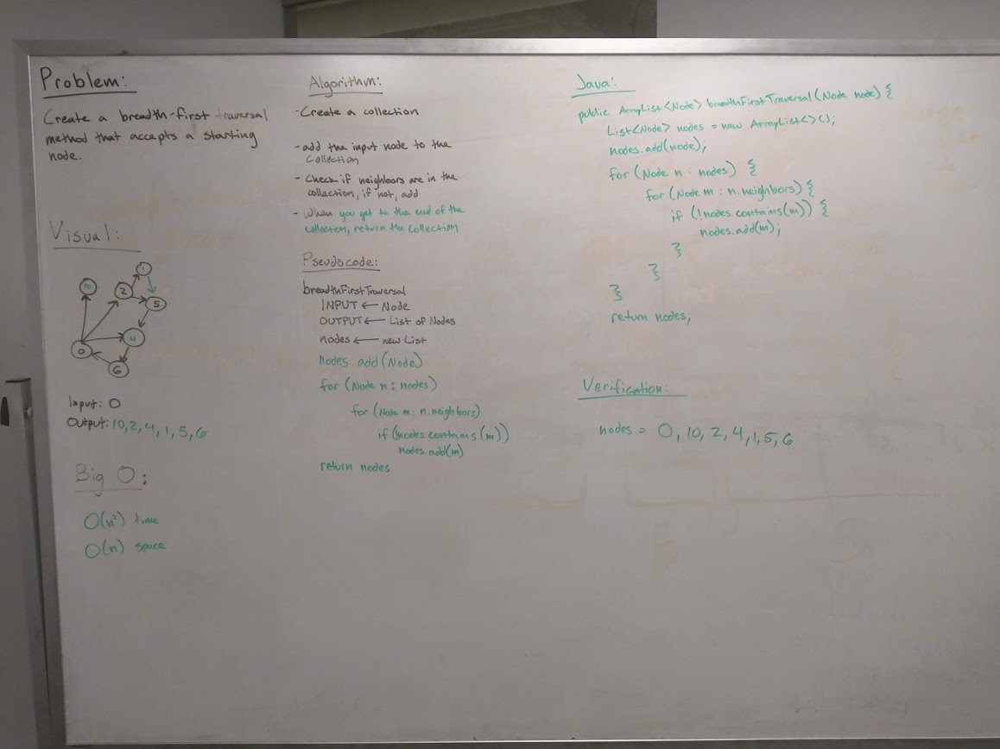

# Code Challenge 3 - Breadth First Traversal - Graphs
Extend your graph object with a breadth-first traversal method that accepts a starting node that returns a collection of nodes in the order they were visited. Display the collection.

## Challenge
* Can't user any built-in methods available to Java
* Graphs don't have a specific order
* Nodes can be neighbors of any other node
* Testing to make sure the returned list of nodes was in the correct order

## Approach & Efficiency
After doing some research online it didn't seem that recursion would've provided a simpler method so I went with iteration
* O(n^2) time (a loop within a loop)
* O(n) space

## Solution
