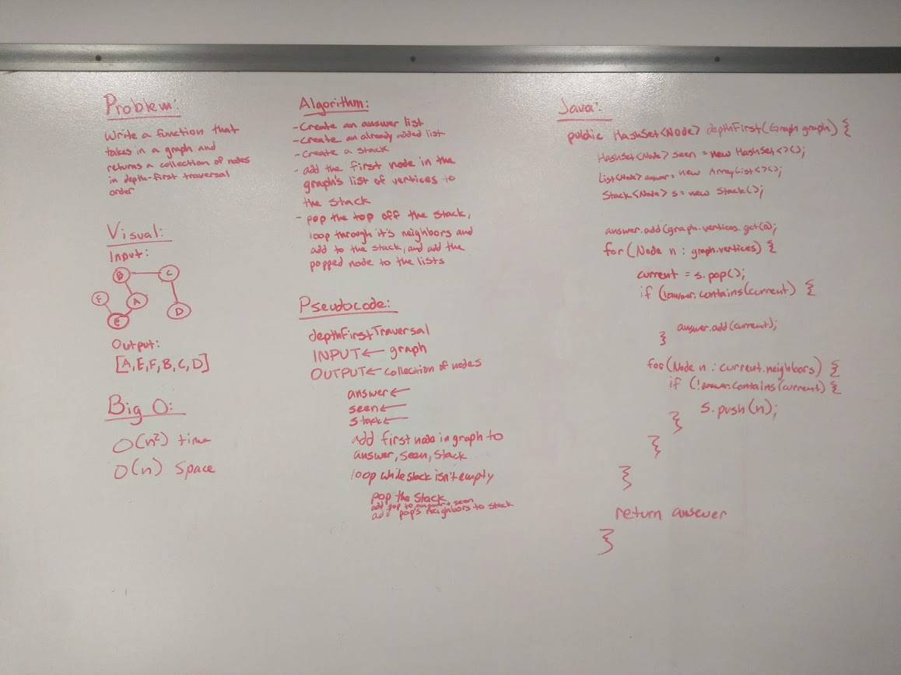

# Depth First Traversal
Conduct a depth first preorder traversal on a graph

## Challenge
Create a function that accepts an adjacency list as a graph, and conducts a depth first traversal. Without utilizing any of the built-in methods available to your language, return a collection of nodes in their pre-order depth-first traversal order.

## Approach & Efficiency
O(n3) space and time - not very efficient but seemed like the easiest solution logically

## Solution
