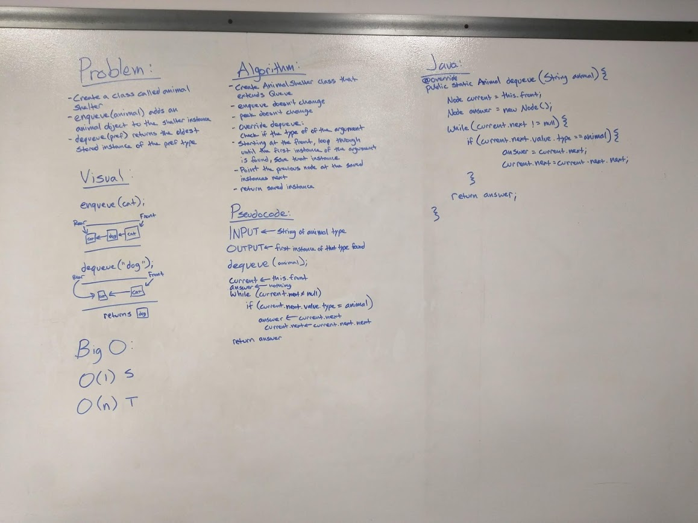

# First-in, First out Animal Shelter.
Continuing on from our work on Stacks and Queues

## Challenge
Create a class called AnimalShelter which holds only dogs and cats. The shelter operates using a first-in, first-out approach.
Implement the following methods:
* enqueue(animal): adds animal to the shelter. animal can be either a dog or a cat object.
* dequeue(pref): returns either a dog or a cat. If pref is not "dog" or "cat" then return null.

## Approach & Efficiency
I took a more roundabout approach in order to meet the stretch goal of being able to return any animal type.
O(n) Time
O(n) 1

## Solution
