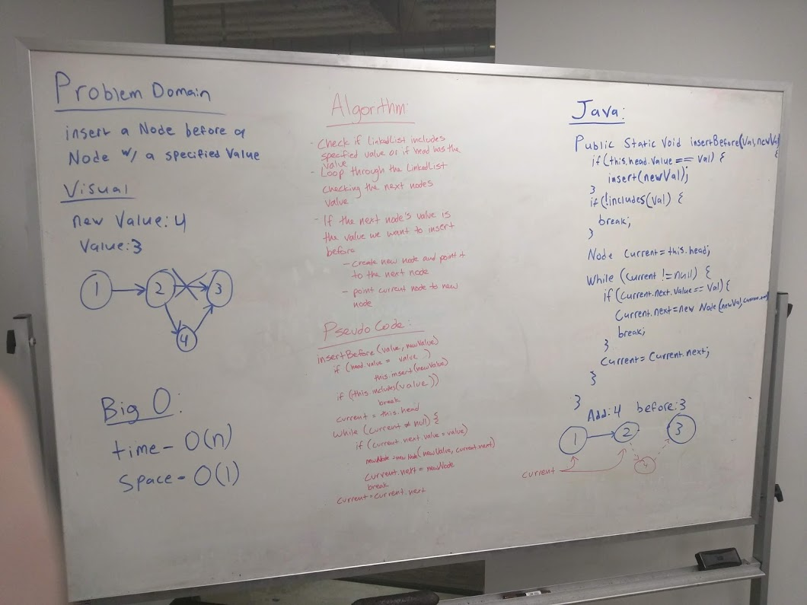
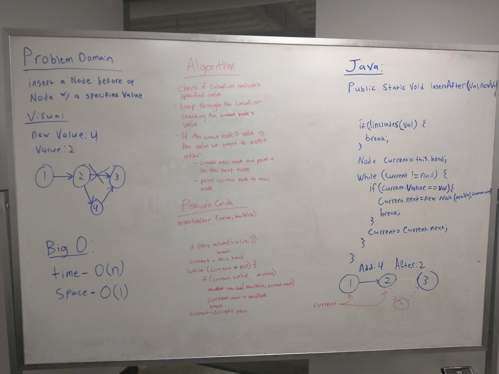

# Linked List Insertions
We were tasked with adding additional methods to the LinkedList class we created earlier for our lab assignment.

## Challenge
We were to add three new methods:
* .append(value) - Adds anew node with the given 'value' to the end of the list
* .insertBefore(value, newVal) - Adds a new node with the given 'newValue' immediately before the node with 'value'
* .insertAfter(value, newVal) - Adds a new node with the given 'newValue' immediately after the node with 'value'

## Approach & Efficiency
|     Method     | Space | Time | Why this approach |
|----------------|-------|------|-------------------|
|   .append()    |  O(1) | O(n) | Because we didn't keep track of the location of the last node in the list, we had to loop through to find the end |
| .insertBefore()|  O(1) | O(n) | Node lists are inefficient when it comes to finding information stored in them, there is no other way to find a node other than to loop through the node |
| .insertAfter() |  O(1) | O(n) | Node lists are inefficient when it comes to finding information stored in them, there is no other way to find a node other than to loop through the node |

## Solution

