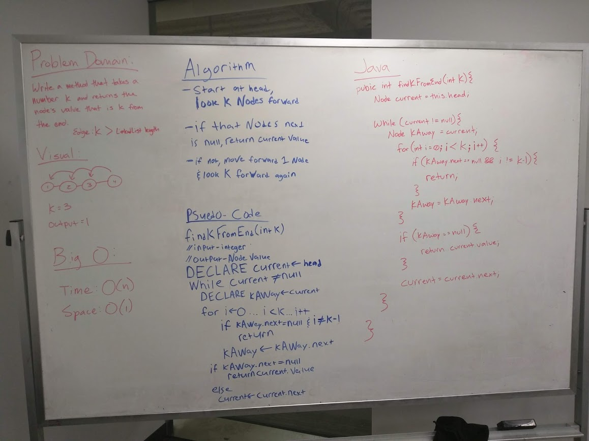

# kth from the end of a Linked List
Solve the challenge using the Node class, all the properties on the Linked List class as well as the methods created in previous challenges.

## Challenge
Write a method for the Linked List class which takes a number, k, as a parameter. Return the node’s value that is k from the end of the linked list

## Approach & Efficiency
Our method "looks" ahead k number of nodes from the current and returns the value of the current node when the .next of k nodes ahead is null.
Space: O(n)
Time: O(1)

## Solution
