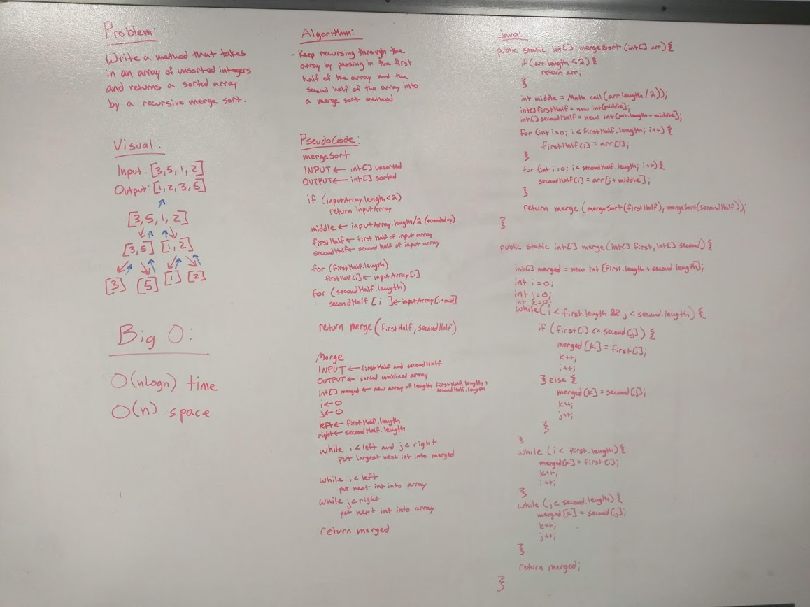

# Mergesort
Implement Mergesort

## Challenge
Write a function that accepts an array of unsorted integers, and returns a sorted array by a recursive mergesort algorithm

## Approach & Efficiency
* O(nLogn) time - continuously cuts the input array in half, and each half is processed again
* O(n) space - creates a new array that is the same length as the input array

## Solution
