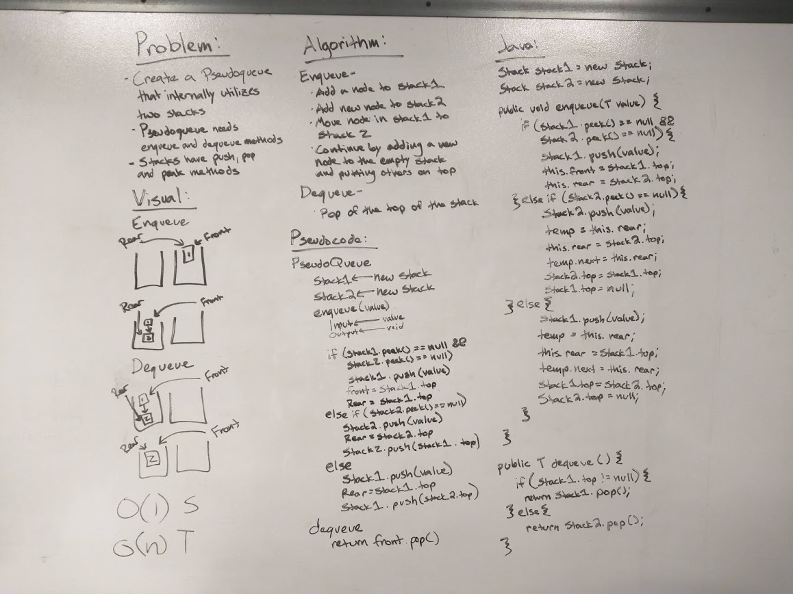

# Implement a Queue using two Stacks
Earlier in the course we wrote Stack classes and Queue classes. In this challenge we created a Queue using two instances of our Stack class.
[CODE](../src/main/java/QueueWithStacks/QueueWithStacks.java)

## Challenge
Create a brand new PseudoQueue class. Do not use an existing Queue. Instead, this PseudoQueue class will implement the standard queue interface, but will internally only utilize 2 Stack objects. Ensure that you create your class with the following methods:
* enqueue(value) which inserts value into the PseudoQueue, using a first-in, first-out approach.
* dequeue() which extracts a value from the PseudoQueue, using a first-in, first-out approach.
* The Stack instances have only push, pop, and peek methods. You should use your own Stack implementation. Instantiate these Stack objects in your PseudoQueue constructor.

## Approach & Efficiency
Due to the restrictions given in the instructions I had to move everything from my first stack into my second in order to enqueue a new node to end.
* Time: O(n)
* Space: O(n)

## Solution
