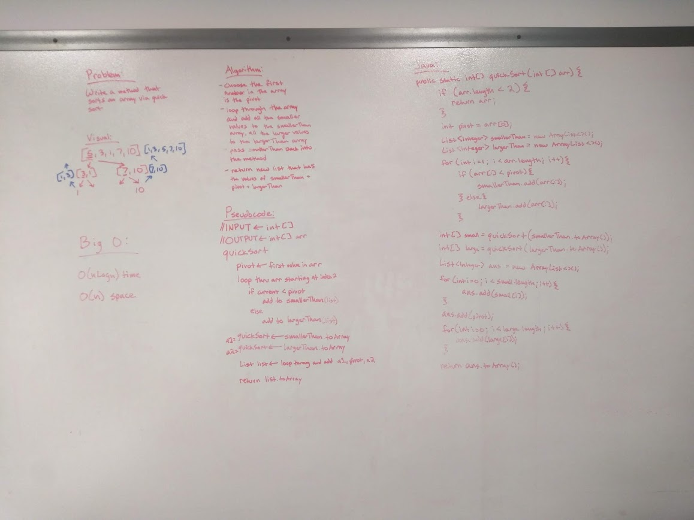

# Quicksort
Implement Quicksort

## Challenge
Write a function that accepts an array of integers, and returns an array sorted by a recursive quicksort algorithm.

## Approach & Efficiency
* O(nlogn) time - The array recurses over smaller portions of itself
* O(1) space - Sorts the array in place

## Solution
