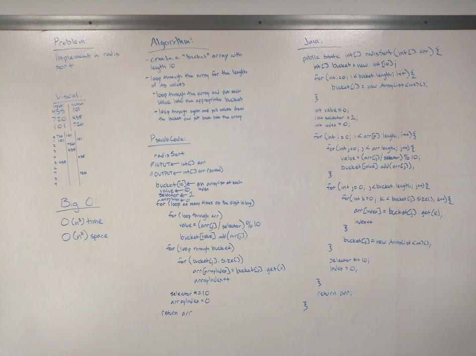

# Quicksort
Implement radix sort

## Challenge
Write a function that accepts an array of positive integers, and returns an array sorted by a radix sort algorithm

## Approach & Efficiency
* O(nd) time - the outer loops runs d times, the inner loop runs 10 times and the innermost loop runs n times
* O(n) space - create ArrayLists whose sizes are dictated by the input array

## Solution
