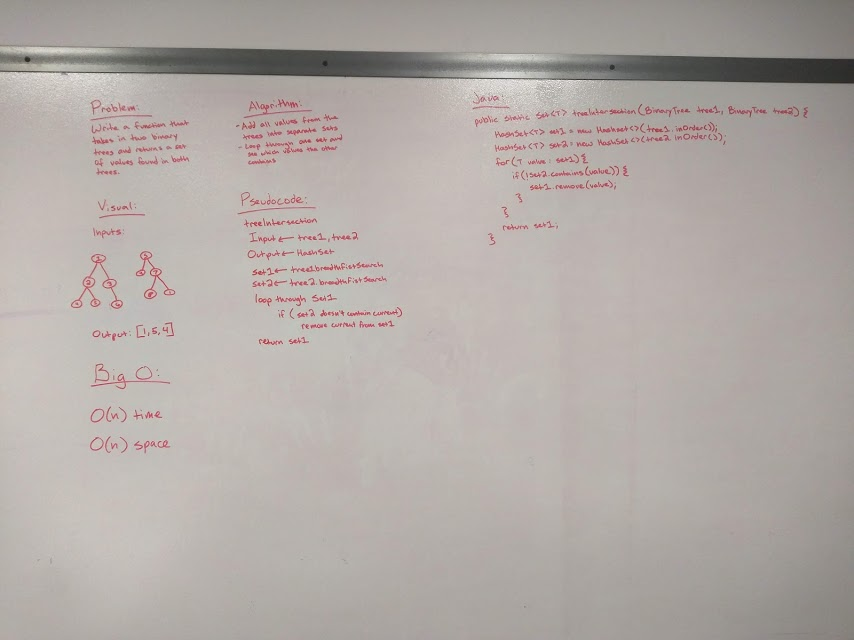

# Intersection of binary trees
Continuation of our work with HashMaps and Sets

## Challenge
Write a function called tree_intersection that takes two binary tree parameters. Without utilizing any of the built-in library methods available to your language, return a set of values found in both trees.

## Approach & Efficiency
* O(n) time - loop over both trees
* O(n) space - Create new sets that are the same length as the trees

## Solution
